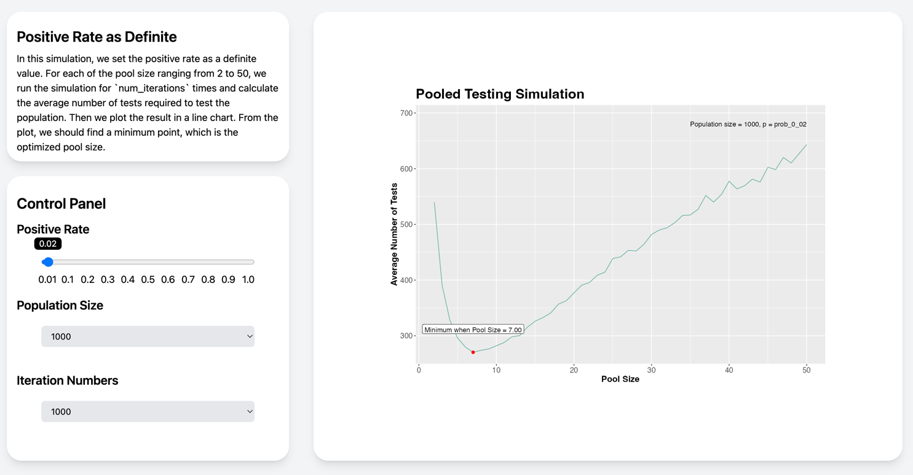
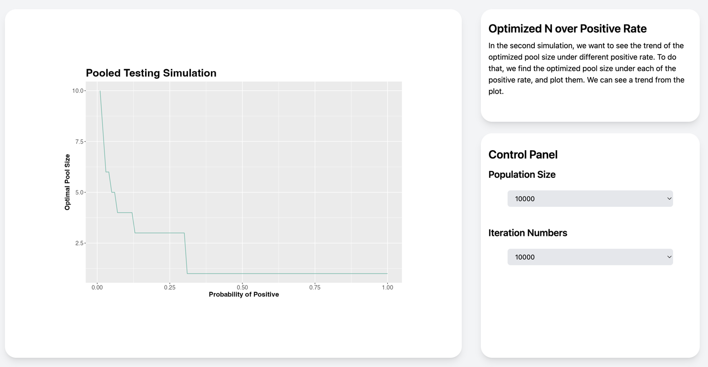

# 2023-Fall-PHP2560-Final-Project: Simulation on Pooled Testing

This is the final project for 2023 Fall PHP 2560.

**Participants:**

- William Qian
- Dingxuan Zhang

## Table of Contents
- [Project Description](#project-description)
- [Pooled Testing](#pooled-testing)
- [Project Structure](#project-structure)
- [How we design the simulation?](#how-we-design-the-simulation)
    - [Single Simulation Process](#single-simulation-process)
    - [Positive Rate as Definite](#positive-rate-as-definite)
    - [Optimized Pool Size over Positive Rate](#optimized-pool-size-over-positive-rate)
- [How we design the Shiny App?](#how-we-design-the-shiny-app)
    - [UI](#ui)
    - [Server](#server)
- [Conclusions](#conclusions)

## Project Description

Pooled testing is a technique used to increase the efficiency of testing for various infectious diseases, including
COVID-19.
It involves combining samples from multiple individuals into a single pool and testing the pool as a whole. This
approach
can significantly reduce the number of tests needed, particularly when the prevalence of the disease is low.

Here's how pooled testing works:

1. Sample Collection: Samples are collected from individuals using standard methods, such as nasal swabs or blood draws.
2. Pooling: Equal volumes of individual samples are combined into a single pool. The number of samples included in a
   pool can vary depending on the test and the expected prevalence of the disease.
3. Testing: The pooled sample is then tested using a standard diagnostic test.
4. Interpretation: If the pooled sample tests positive, it indicates that one or more individuals in the pool are
   infected. This triggers individual testing of all members of the pool to identify the positive individuals.

In this project, we will simulate the process of pooled testing and find the optimal pool size for different prevalence
rates,
and demonstrate the result through a Shiny app. Different plots, tables and user inputs will be available in the app.

## Pooled Testing

Here we will present this question as a mathematical problem. Assume here we have a population size of $N$. If we are to
conduct testing on every member of this population, we are going to tests $N$ times, which is very inefficient if the
number of individuals testing positive is low. Instead, we will use pooled testing to separate the population into
groups of $k$ people. In this scenario, if no one is positive in this group, we only need one test and the number of
tests for each individual is $\frac{1}{k}$. If there is people testing positive, we then do testing on each member of
this group, which means the number of tests for each individual is $1 + \frac{1}{k}$. Now assume the probability for an
individual to be positive is $p$, we can derive the expectation of the number of tests for an individual, which is given
by:

$$
E(x)=\frac{1}{k} (1-p)^{k} + (1+\frac{1}{k})[1-(1-p)^{k}]= 1 - (1-p)^{k} + \frac{1}{k}
$$

Hence, as long as we have this expectation below 1, this method is more efficient than taking tests on all individuals.
We present two tables on the right side to demonstrate some results using this formula.

Table 1: Expectation of Average Tests Numbers vs Pool Size under Positive Rate of p=0.1

| **$k$** |   2   |   3   |   4   |   5   |   8   |  10   |  30   |   33   |   34   |
|:-------:|:-----:|:-----:|:-----:|:-----:|:-----:|:-----:|:-----:|:------:|:------:|
| $E(X)$  | 0.690 | 0.604 | 0.594 | 0.610 | 0.695 | 0.751 | 0.991 | 0.9994 | 1.0016 |

Table 2: The optimized pool size k and E(X) under different positive rate p

|        $p$         | **0.14** | **0.10** | **0.08** | **0.06** | **0.04** | **0.02** | **0.01** |
|:------------------:|:--------:|:--------:|:--------:|:--------:|:--------:|:--------:|:--------:|
| $\text{Optimal }k$ |    3     |    4     |    4     |    5     |    6     |    8     |    11    |
|       $E(X)$       |  0.697   |  0.594   |  0.534   |  0.466   |  0.384   |  0.274   |  0.196   |

## Project Structure

Different from normal build of shiny app, this app is built on a `HTML` template, which is located in the `www` folder.
The `app.R` file is the main file of the app.

The reason why we choose this structure is that we want to make the app more beautiful and more interactive. By
implementing with
`Tailwind CSS`, the user interface now looks more modern and beautiful. However, by doing such practice, we have to give
up some
features that are available in normal shiny app, meaning that we have to build those features from scratch. Luckily, we
made it.

The app is divided into three parts: `Introduction`, `Simulation` and `Conclusion`:

- `Introduction`: This part is the introduction of pooled testing, which takes the first page of the app. It includes
  the basic idea of pooled testing, the advantages of using pooled testing. And we also include the math behind pooled
  testing.
- `Simulation`: This part is the main part of the app. It includes the simulation of pooled testing, the plots and
  tables.
    - **Positive Rate as Definite**: This simulation allows users to input the positive rate, population size
      and number of iterations as parameters. The app will then simulate the pooled testing process and find the
      optimized pool size under the given parameters,
      and plot the result in a line chart.
    - **Optimized Pool Size over Positive Rate**: In order to see the trend of the optimized pool size under different
      positive rate, we
      set the positive rate as a definite value. In this simulation, users can input the population size and number of
      iterations as parameters.
    - **Data Demonstration**: This part allows user to directly check the data we obtained from the simulation. Users
      can
      input the population size and number of iterations as parameters.
- `Conclusion`: This part is the conclusion of the app. It includes the summary of the findings we obtained from the
  simulation.

And this is the structure of the repository:

```text
2023-Fall-PHP2560-Final-Project
├── README.md
├── app.R
├── data
│   ├── population_10000_iterations_100.csv
│   ├── population_10000_iterations_1000.csv
│   ├── population_10000_iterations_10000.csv
│   ├── population_1000_iterations_100.csv
│   ├── population_1000_iterations_1000.csv
│   ├── population_1000_iterations_10000.csv
│   ├── population_100_iterations_100.csv
│   ├── population_100_iterations_1000.csv
│   ├── population_100_iterations_10000.csv
│   ├── population_5000_iterations_100.csv
│   ├── population_5000_iterations_1000.csv
│   ├── population_5000_iterations_10000.csv
│   ├── population_500_iterations_100.csv
│   ├── population_500_iterations_1000.csv
│   └── population_500_iterations_10000.csv
├── resources
│   ├── concept_verification.png
│   ├── example1.png
│   ├── example2.png
│   ├── simulation1_ui.png
│   └── simulation2_ui.png
├── simulations
│   ├── data_generation.R
│   ├── pooled_testing.R
│   ├── simulation_poolsize.R
│   └── simulation_prob_positive.R
└── www
    └── index.html
```

## How we design the simulation?

The simulation is based on the following **assumptions**:

- The distribution of the positive rate is binomial distribution.
- The test is 100% accurate, meaning that there is no false positive or false negative.
- The test is independent, meaning that the result of one test will not affect the result of another test.

### Single Simulation Process

Since the simulation of `Optimized Pool Size over Positive Rate` and `Positive Rate as Definite` mainly differ in input
parameters, we can
extract the single simulation process as a function. The function is defined as follows:

```r
simulate_pooled_testing <- function(pool_size, prob_positive, num_iterations, population_size) {
  #' Simulate pooled testing
  #'
  #' @param pool_size The number of samples in each pool
  #' @param prob_positive The probability of a sample being positive
  #' @param num_iterations The number of iterations to run the simulation
  #' @param population_size The size of the population
  #' @return The average number of tests required to test the population

  total_tests <- c()

  for (i in 1:num_iterations) {
    # generate a population of size population_size with prob_positive probability of being positive
    population <- rbinom(population_size, 1, prob_positive)
    # take samples of size pool_size from the population
    samples <- replicate(as.integer(population_size / pool_size), sample(population, pool_size, replace = TRUE))
    # test each sample
    tests <- apply(samples, 2, function(x) sum(x) > 0)

    if ("FALSE" %in% tests) {
      negative_tests <- as.numeric(table(tests)["FALSE"])
    }else {
      negative_tests <- 0
    }

    if ("TRUE" %in% tests) {
      positive_tests <- as.numeric(table(tests)["TRUE"])
    }else {
      positive_tests <- 0
    }

    # calculate the total number of tests
    total_tests <- c(total_tests, negative_tests + positive_tests * (pool_size + 1))
  }

  return(mean(total_tests))
}
```

In this function, we first generate a population of size `population_size` with `prob_positive` probability of being
positive.
Then we take samples of size `pool_size` from the population. After that, we test each sample. If there is at least one
positive sample in the group,
we will test each individual in the group. Otherwise, we will not test each individual in the group. Finally, we
calculate the total number of tests. We
repeat this process for `num_iterations` times and take the average of the total number of tests and return it.

### Positive Rate as Definite

In this simulation, we set the positive rate as a definite value. For each of the pool size ranging from 2 to 50, we run
the simulation for `num_iterations` times and
calculate the average number of tests required to test the population. Then we plot the result in a line chart. From the
plot, we should find a minimum point, which is the optimized pool size.

```r
# simulation parameters
POPULATION_SIZE <- 1000
PROB_POSITIVE <- 0.02
MIN_POOL_SIZE <- 2
MAX_POOL_SIZE <- 40
NUM_ITERATIONS <- 1000

AvgTests <- c()
# pool_size iterations
for (pool_size in MIN_POOL_SIZE:MAX_POOL_SIZE) {
  avg_tests <- simulate_pooled_testing(pool_size, PROB_POSITIVE, NUM_ITERATIONS, POPULATION_SIZE)
  AvgTests <- c(AvgTests, avg_tests)
}

results <- data.frame(PoolSize = MIN_POOL_SIZE:MAX_POOL_SIZE, AvgTests = AvgTests)

print(results)

# plot the results
ggplot(results, aes(x = PoolSize, y = AvgTests)) +
  geom_line() +
  labs(title = "Pooled Testing Simulation",
       x = "Pool Size",
       y = "Average Number of Tests")
```

An example is shown below:


### Optimized Pool Size over Positive Rate

In the second simulation, we want to see the trend of the optimized pool size under different positive rate.
To do that, we find the optimized pool size under each of the positive rate, and plot them. We can see a trend from the
plot.

```r
# simulation parameters
POPULATION_SIZE <- 1000
MIN_POOL_SIZE <- 2
MAX_POOL_SIZE <- 30
NUM_ITERATIONS <- 100

results <- data.frame(ProbPositive = c(), PoolSize = c(), MinAvgTests = c())

# prob_positive iterations
for (prob_positive in seq(0.01, 1, 0.01)) {
  avg_tests <- c()
  # pool_size iterations
  for (pool_size in MIN_POOL_SIZE:MAX_POOL_SIZE) {
    avg_tests <- c(avg_tests, simulate_pooled_testing(pool_size, prob_positive, NUM_ITERATIONS, POPULATION_SIZE))
  }

  # if the average number of tests is greater than the population size, then the test numbers are set to the population size
  if (min(avg_tests) >= POPULATION_SIZE) {
    results <- rbind(results, data.frame(ProbPositive = prob_positive, PoolSize = 1, MinAvgTests = POPULATION_SIZE))
  } else {
    results <- rbind(results, data.frame(ProbPositive = prob_positive, PoolSize = which.min(avg_tests) + 1, MinAvgTests = min(avg_tests)))
  }
}

print(results)

# plot the results
ggplot(results, aes(x = ProbPositive, y = PoolSize)) +
  geom_line() +
  labs(title = "Pooled Testing Simulation",
       x = "Probability of Positive",
       y = "Optimal Pool Size")
```

An example is shown below:


## How we design the Shiny App?

Our shiny app has two parts: `UI` and `Server`. In the `UI` part, we mainly use `HTML` and `Tailwind CSS` to design the
user interface.
In the `Server` part, we mainly use basic `R` to implement the functions and logic of the app.

### UI

Instead of using the traditional `Bootstrap` design, we prefer a more modern and beautiful design. Therefore, we
choose `Tailwind CSS` as our CSS framework.
In the `www` folder, we have a `index.html` file, which is the template of the app. In the `app.R` file, we
use `includeHTML` function to include the template.

We use `card` layout as our main design, which makes user have a clear view of the app. Some examples are shown below:

Example of **Positive Rate as Definite** simulation:


Example of **Optimized Pool Size over Positive Rate** simulation:


### Server

We offered our user server options to see different results under different parameters. However, some of the parameters
will
lead to great amount of time to run the simulation. Therefore, we pre run all the possible simulations and save the
results in the `data` folder.
When user choose a certain parameter, we will read the corresponding data and show the result to the user.

The following code gives an example on how we read the data based on user input and transform the data into the type that we want:
```r
  processed_data_simulation_2 <- reactive({
    population <- as.integer(input$pr_var_pop_options)
    num_iterations <- as.integer(input$pr_var_iter_options)


    file_name <- sprintf("data/population_%d_iterations_%d.csv", population, num_iterations)
    data_simulation_2 <- read.csv(file_name)[1:30,]

    probs <- seq(0.01, 1, 0.01)
    min_avg_tests <- numeric(ncol(data_simulation_2) - 1)
    optimized_n <- numeric(ncol(data_simulation_2) - 1)

    # if the average number of tests is greater than the population size, then the test numbers are set to the population size
    for (i in 2:ncol(data_simulation_2)) {
      min_row <- which.min(data_simulation_2[[i]])
      if (data_simulation_2[min_row, i] > population) {
        min_avg_tests[i - 1] <- population
        optimized_n[i - 1] <- 1
      } else {
        min_avg_tests[i - 1] <- data_simulation_2[min_row, i]
        optimized_n[i - 1] <- data_simulation_2[min_row, 1]
      }
    }

    data.frame(PositiveProb = probs, MinAvgTests = min_avg_tests, OptimizedN = optimized_n)
  })
```

## Conclusions

1. As the value of p decreases, the pooled testing method will have a higher optimal group size and will achieve better
   performance. When we have a fixed p, the effectiveness represented by expectation of tests will drop first and then
   rise again after reaching the optimal point.
2. By doing simulation, we derive that the optimal number of pooled size drops to 1 around p value around 0.3, which
   caters to our expectation that this pooled testing method is only useful when we have a relatively small value of p.
3. In theory, the value of population size N shall not affect the outcome of our optimal group size. The effectiveness
   of pooled testing method solely depends on the value of p and group size k. This can be seen from our second plot.

Results Comparison:

- Table 3: The optimized pool size k and E(X) under different positive rate p (Theoretical Results)

|        $p$         | **0.14** | **0.10** | **0.08** | **0.06** | **0.04** | **0.02** | **0.01** |
|:------------------:|:--------:|:--------:|:--------:|:--------:|:--------:|:--------:|:--------:|
| $\text{Optimal }k$ |    3     |    4     |    4     |    5     |    6     |    8     |    11    |
|       $E(X)$       |  0.697   |  0.594   |  0.534   |  0.466   |  0.384   |  0.274   |  0.196   |

- Table 4: The optimized pool size k and E(X) under different positive rate p (Simulation Results)

|        $p$         | **0.14** | **0.10** | **0.08** | **0.06** | **0.04** | **0.02** | **0.01** |
|:------------------:|:--------:|:--------:|:--------:|:--------:|:--------:|:--------:|:--------:|
| $\text{Optimal }k$ |    3     |    4     |    4     |    5     |    6     |    8     |    11    |
|       $E(X)$       |  0.697   |  0.594   |  0.534   |  0.466   |  0.384   |  0.274   |  0.196   |

We can see that the simulation results are very close to the theoretical results. This means that our simulation works
very well.

